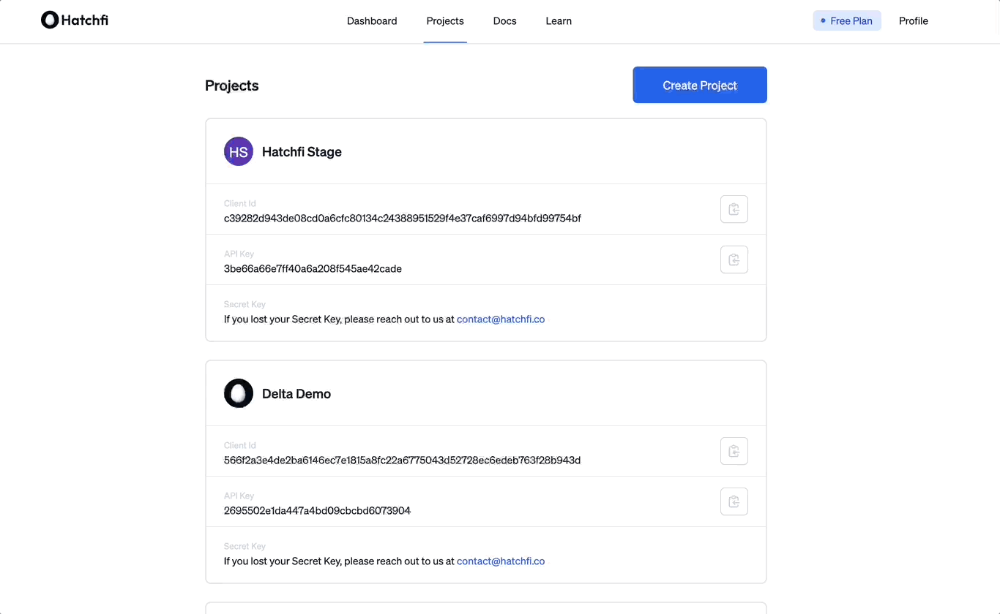

title: Hatchfi API Overview
slug: aCrP-hatchfi-api-overview
createdAt: Mon May 30 2022 02:56:24 GMT+0000 (Coordinated Universal Time)
updatedAt: Mon Aug 15 2022 13:53:29 GMT+0000 (Coordinated Universal Time)
---

### Here you'll find guides, resources, and references to build amazing crypto-powered financial applications using Hatchfi.

## Overview of Hatchfi's APIs

Hatchfi is an API to easily connect your users' cryptocurrency accounts and financial data to your app with just a few lines of code. Our API enables app developers and product builders to easily create crypto-powered financial applications without having to spend exorbitant amounts of time and engineering resources managing your own integrations.

With the Hatchfi API, you can easily fetch historical and current crypto financial data from users' wallets, exchange accounts, and addresses, including:

*   ****[**Accounts**](https://www.hatchfi.co/accounts)****

*   ****[**Balances**](https://www.hatchfi.co/balances)****

*   ****[**Transactions**](https://www.hatchfi.co/transactions)****

See our [providers](https://hatchfi.co/providers) page for a complete list of cryptocurrency connections with exchanges, wallets, and accounts Hatchfi supports.

[Discord](https://discord.gg/hatchfi) - if you have any questions or need help with implementation, please contact us via our Discord community.

Check out our live demo below:&#x20;

***

# Getting started: Create a Project

Before integrating Hatchfi into your application, you must create a project in your dashboard.&#x20;

A project consists of:

*   Project name

*   Project Logo

*   Client ID

*   API Key

*   Secret Key

To create a project, navigate to the [Hatchfi Dashboard > Projects](https://app.hatchfi.co/projects) and create a new project.

Once you've created a project, add the `API Key` and `Secret Key` to your project's environment variables.&#x20;

:::hint
ℹ️ Note that your Secret Key will only be shown once. Please save it in your environment variables.
:::

## Important Links

*   [Hatchfi SDK](https://www.npmjs.com/package/@hatchfi/sdk-js)

*   [Hatchfi Link](docs.hatchfi.co/link)

*   [Hatchfi Blog](blog.hatchfi.co)

*   [Hatchfi Community](discord.gg/hatchfi)

