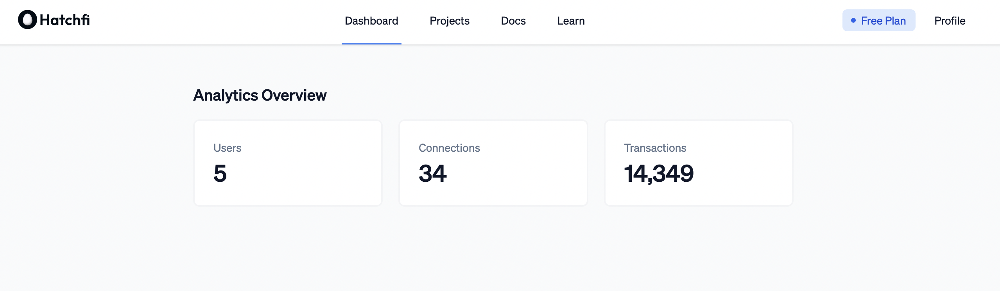
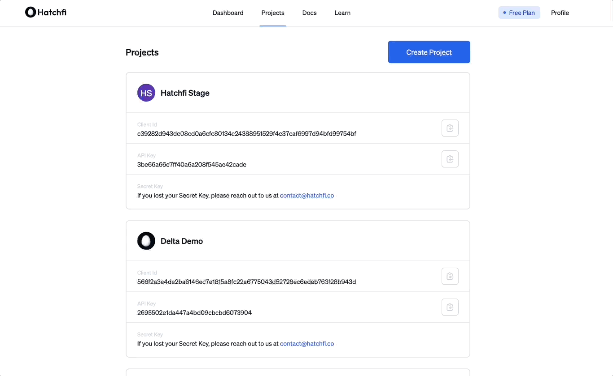

title: Hatchfi Dashboard Overview
slug: jP73-hatchfi-dashboard-overview
createdAt: Tue May 31 2022 13:59:53 GMT+0000 (Coordinated Universal Time)
updatedAt: Sun Aug 21 2022 17:55:51 GMT+0000 (Coordinated Universal Time)
---

# Overview

The Hatchfi dashboard gives you a quick and easy way to manage your projects, analytics, billing, and more.

### Dashboard Layout

*   **Dashboard Analytics** - data analytics for your apps with Hatchfi

*   **Projects** - project-based key access to access the Hatchfi API

*   **Docs** - you are here

*   **Learn** - important guides, docs, and other learning content

*   **Profile & Billing** - manage your billing and profile information&#x20;

***

# Dashboard Analytics

Our dashboard analytics gives you a complete overview of your project usage data, billing (coming soon), and more. Currently, we support the following data:&#x20;

*   **Connections** - the total amount of accounts your users have connected via Hatchfi API

*   **Users** - the total amount of users on your app that has connected accounts or wallets

*   **Transactions** - the total amount of transactions stored in Hatchfi&#x20;

***

# Projects

Projects are what you create in order to access the Hatchfi API.  Each project has dedicated credentials that are meant for a single application. For example, if you are building two separate apps with the Hatchfi API, you'd create a project for each app within the Hatchfi Dashboard.

