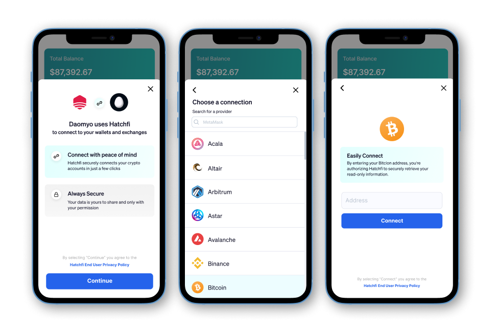

title: Hatchfi Link Overview
slug: _F5k-hatchfi-link-overview
createdAt: Mon May 30 2022 06:50:25 GMT+0000 (Coordinated Universal Time)
updatedAt: Sun Aug 21 2022 17:56:56 GMT+0000 (Coordinated Universal Time)
---

Link is used for connecting your customers' crypto accounts with the Hatchfi API

## What is Hatchfi Link?

Hatchfi Link is a plug-and-play front-end component that helps you streamline the onboarding experience of your customers' crypto data.&#x20;

Hatchfi Link will handle credential validation via Oauth, API credentials, and wallet addresses. Hatchfi Link will also perform error handling for each provider integration we support. Hatchfi Link can be implemented within an [iframe ](https://www.w3schools.com/tags/tag_iframe.asp)or as a stand-alone browser tab. Hatchfi Link also supports and works across all modern browsers and platforms.

