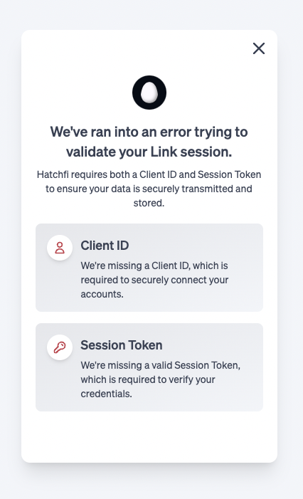

title: Unauthorized Session Error
slug: vmT4-unauthorized-session-error
createdAt: Sun Aug 21 2022 17:54:24 GMT+0000 (Coordinated Universal Time)
updatedAt: Sun Aug 21 2022 17:54:37 GMT+0000 (Coordinated Universal Time)
---

The above state of Link is returned when you do not provide the correct credentials, I.E., there is a mismatch of `clientId` and the `token` OR the `token` has expired.  If this occurs, you must confirm that you are authenticating the correct `clientId` associated with the `API Key` and the `Secret Key`.  If this authentication information is correct, it could also be that your Link `token` is no longer valid, and you will need to reauthenticate to retrieve a valid `token` session.

